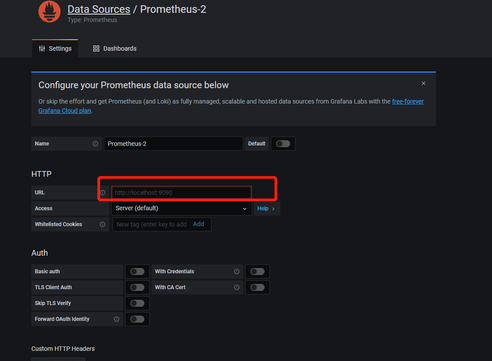
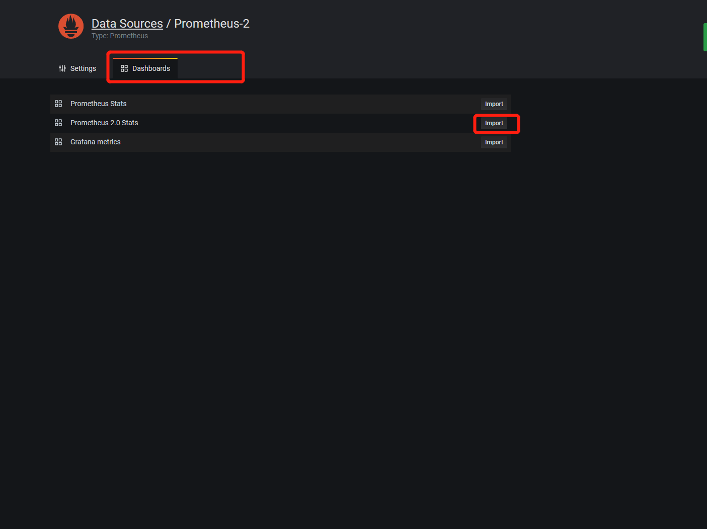
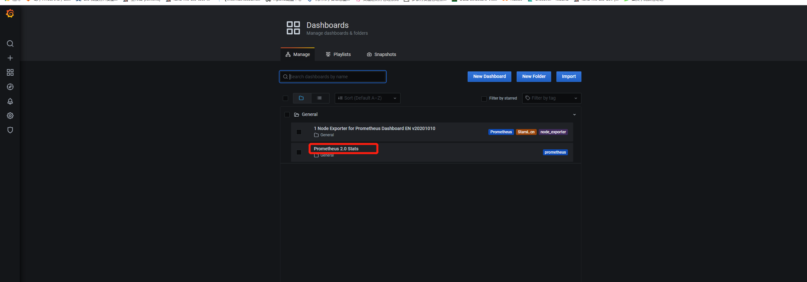
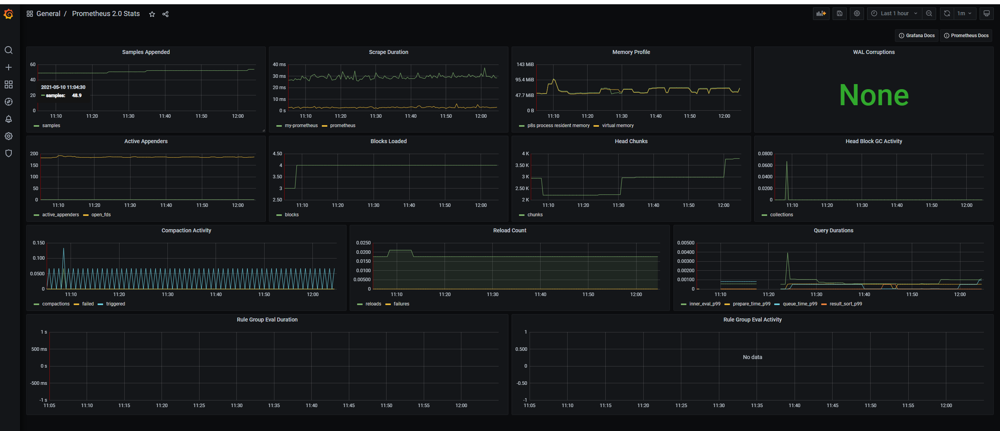

>Prometheus 是一个开源的服务监控系统和时间序列数据库。
Prometheus是一款开源的监控 + 时序数据库 + 报警软件，由SoundCloud公司开发的。目前在CNCF基金会托管，并已成功孵化。
Prometheus是由SoundCloud开发的开源监控报警系统和时序列数据库(TSDB)。Prometheus使用Go语言开发，是Google BorgMon监控系统的开源版本。
2016年由Google发起Linux基金会旗下的原生云基金会(Cloud Native Computing Foundation), 将Prometheus纳入其下第二大开源项目。
Prometheus目前在开源社区相当活跃。
Prometheus和Heapster(Heapster是K8S的一个子项目，用于获取集群的性能数据。)相比功能更完善、更全面。Prometheus性能也足够支撑上万台规模的集群。**

> Prometheus实现了监控数据的可视化，然而使用体验并不好。下面来用Grafana实现更友好、更贴近生产的监控可视化。
Grafana是一个开源的跨平台度量分析和可视化 + 告警工具。
Grafana是用于可视化大型测量数据的开源程序，它提供了强大和优雅的方式去创建、共享、浏览数据。
Dashboard中显示了你不同metric数据源中的数据。
Grafana最常用于因特网基础设施和应用分析，但在其他领域也有用到，比如：工业传感器、家庭自动化、过程控制等等。
Grafana支持热插拔控制面板和可扩展的数据源，目前已经支持Graphite、InfluxDB、OpenTSDB、Elasticsearch、Prometheus等。

#使用prometheus: 
   ##1:解压prometheus-2.26.0.windows-amd64.zip
   ##2：修改prometheus.yml，可参考file目录下的prometheus.yml,修改完后，点击prometheus.exe 运行,浏览器中输入localhost:9090即可
#使用grafana:
   ##1:解压grafana-7.5.5.windows-amd64.zip
   ##2：找到bin目录下的grafana-server.exe，点击执行,浏览器输入localhost:3000,默认账号密码admin/admin
   ##3:配置数据源
   ##4：输入prometheus的端口 保存
   ##5:切换tab页，点击import
   ##6：点击刚刚导入的，即可看到监控画面
   ##7：